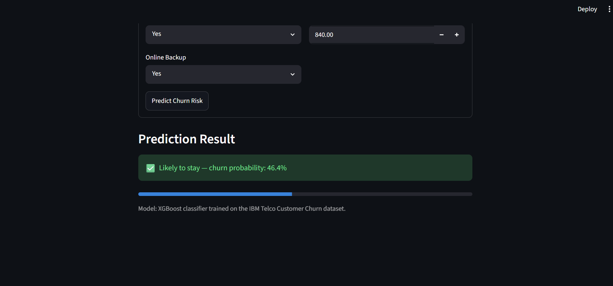

# Telco Customer Churn Prediction

An end-to-end machine learning project that predicts whether a telecom customer will churn
(cancel their subscription), built for the ML Engineering Intern technical assessment.

## Project Overview

Customer churn is one of the highest-leverage problems in subscription businesses: acquiring a
new customer typically costs far more than retaining an existing one. This project builds a
complete pipeline — from raw data to a deployable prediction interface — that identifies
customers at high risk of churning so a retention team could intervene before they leave.

## Problem Statement

**Type:** Binary classification
**Target:** `Churn` — will this customer cancel their service? (`Yes` / `No`)
**Goal:** Given a customer's account and service details, predict their churn probability, so a
business can prioritize retention outreach toward the customers most likely to leave.

## Dataset Description

- **Source:** [IBM Telco Customer Churn dataset](https://github.com/IBM/telco-customer-churn-on-icp4d) (public, widely used for churn benchmarking)
- **Size:** 7,043 customers x 21 columns (20 features + target), after cleaning: 7,021 rows (22 exact duplicates removed)
- **Features:** demographics (gender, senior citizen, partner, dependents), account info
  (tenure, contract type, payment method, billing), and subscribed services (phone, internet,
  online security, streaming, etc.)
- The raw CSV is included at `data/Telco-Customer-Churn.csv` (~950 KB, well under the 100 MB limit).

## Installation Guide

```bash
# 1. Clone the repository
git clone https://github.com/<your-username>/ML-Intern-Assessment-<YourName>.git
cd ML-Intern-Assessment-<YourName>

# 2. Create and activate a virtual environment (Python 3.10+)
python3 -m venv venv
source venv/bin/activate      # Windows: venv\Scripts\activate

# 3. Install dependencies
pip install -r requirements.txt
```

## Execution Instructions

```bash
# Run EDA (generates plots + written summary in reports/)
python src/eda.py

# Train the baseline + 3 tuned models, save the best one
python src/train.py

# Generate confusion matrices, ROC curves, feature importance, results summary
python src/evaluate.py

# Quick sanity-check prediction from the command line
python src/predict.py

# Launch the interactive prediction app
streamlit run app/app.py
```

## Project Structure

```
project-name/
|-- README.md
|-- requirements.txt
|-- .gitignore
|-- LICENSE
|-- data/
|   `-- Telco-Customer-Churn.csv
|-- notebooks/
|   `-- customer_churn_analysis.ipynb   # narrative walkthrough of the full pipeline
|-- src/
|   |-- eda.py                # exploratory data analysis
|   |-- preprocessing.py      # cleaning, encoding, scaling, train/test split
|   |-- train.py              # baseline + 3 tuned models, model selection
|   |-- evaluate.py           # confusion matrix / ROC / feature importance / summary
|   `-- predict.py            # reusable prediction pipeline
|-- models/
|   `-- saved_model/
|       |-- churn_model.joblib     # final trained pipeline (preprocessing + model)
|       `-- model_metadata.json
|-- app/
|   `-- app.py                # Streamlit prediction interface
`-- reports/
    |-- eda_summary.md
    |-- results_summary.md
    |-- model_comparison.json
    `-- images/                # all generated plots
```

## Methodology

1. **Data cleaning** — dropped the `customerID` identifier column; coerced `TotalCharges`
   (shipped as text) to numeric and imputed the 11 blank entries as 0, since they all
   correspond to customers with `tenure == 0` (not yet billed); removed 22 exact duplicate rows.
2. **EDA** — examined class balance (~73% retained / ~27% churned), numeric distributions and
   outliers, correlation between numeric features and churn, and churn rate broken down by
   contract type, internet service, and payment method (see `reports/eda_summary.md`).
3. **Preprocessing** — `StandardScaler` on numeric features (`tenure`, `MonthlyCharges`,
   `TotalCharges`), `OneHotEncoder(handle_unknown="ignore")` on 16 categorical features, wrapped
   in a single `sklearn.ColumnTransformer` inside a `Pipeline` so the exact same transformation
   is applied at train and inference time — nothing is fit or hand-computed outside the pipeline.
4. **Modeling** — a plain, untuned Logistic Regression baseline, then three tuned candidates:
   Logistic Regression, Random Forest, and XGBoost, each optimized with `GridSearchCV` over a
   5-fold stratified cross-validation, scored on ROC-AUC.
5. **Evaluation** — accuracy, precision, recall, F1, ROC-AUC, confusion matrices, and ROC curves
   on a held-out 20% test set (stratified split), plus feature importance for the winning model.
6. **Final model selection** — by ROC-AUC on the test set (see justification below).
7. **Deployment** — a Streamlit form that takes the same 19 raw fields as the dataset and returns
   a churn prediction + probability, using the saved pipeline directly (no re-implemented logic).

## Algorithms Used

| Model | Role |
|---|---|
| Logistic Regression (untuned) | Baseline |
| Logistic Regression (tuned) | Candidate 1 |
| Random Forest | Candidate 2 |
| XGBoost | Candidate 3 (**final model**) |

Class imbalance (~73/27) was handled via `class_weight="balanced"` (Logistic Regression, Random
Forest) and `scale_pos_weight` (XGBoost) rather than resampling, to avoid distorting the real
class distribution the model will see in production.

## Results

| Model | Accuracy | Precision | Recall | F1 | ROC-AUC |
|---|---|---|---|---|---|
| Logistic Regression (baseline, untuned) | 0.803 | 0.661 | 0.524 | 0.585 | 0.840 |
| Logistic Regression (tuned) | 0.739 | 0.504 | 0.782 | 0.613 | 0.840 |
| Random Forest (tuned) | 0.742 | 0.509 | 0.790 | 0.619 | 0.841 |
| **XGBoost (tuned) — selected** | **0.758** | **0.529** | **0.796** | **0.635** | **0.843** |

**Why XGBoost was selected:** ROC-AUC (not accuracy) was used as the primary selection metric
because the dataset is imbalanced — a model that always predicts "No Churn" would already score
~73% accuracy without being useful. ROC-AUC measures ranking quality across all thresholds, which
matters because a business would tune its decision threshold based on the cost of a retention
offer vs. the cost of losing a customer, rather than accept the default 0.5 cutoff. XGBoost had
the highest test ROC-AUC (0.843) and the best recall (0.796) among the tuned models — in a churn
context, missing an actual churner (false negative) is usually costlier than an unnecessary
retention offer to a loyal customer (false positive), so recall on the positive class was
weighted heavily in the decision alongside ROC-AUC.

**Top churn drivers** (from feature importance, see `reports/images/08_feature_importance.png`):
contract type (month-to-month customers churn far more), tenure (newer customers churn more),
internet service type (fiber optic customers churn more despite/because of higher pricing), and
payment method (electronic check payers churn more than automatic-payment customers).

See `reports/eda_summary.md` and `reports/results_summary.md` for full written detail, and
`reports/images/` for all plots (class distribution, numeric distributions, outlier boxplots,
correlation heatmap, churn rate by category, confusion matrices, ROC curves, feature importance).

## Screenshots


## Known Limitations

- Dataset is a single static snapshot — no temporal/behavioral trend data (e.g. usage change
  over time, support ticket history) which would likely improve predictive power.
- Class imbalance was handled via class weighting rather than more advanced techniques like
  SMOTE, which could be explored further.
- Hyperparameter search grids were kept intentionally small to keep runtime reasonable; a wider
  or Bayesian search (e.g. Optuna) would likely yield marginal further gains.
- The model was not calibrated (`CalibratedClassifierCV`) — predicted probabilities are useful
  for ranking customers by risk but shouldn't be read as precisely calibrated probabilities.

## Future Improvements

- Add SHAP-based explanations per prediction for interpretability in the app.
- Track experiments with MLflow instead of flat JSON files.
- Containerize with Docker for consistent deployment.
- Add unit tests for `preprocessing.py` and `predict.py`.
- Explore threshold tuning / cost-sensitive decision thresholds tied to actual retention-offer
  economics rather than the default 0.5 cutoff.

## Author

Sandhya Mandlik — ML Engineering Intern Candidate, Shakalya International Technical Assessment

## License

This project is licensed under the MIT License — see [LICENSE](LICENSE) for details.
